# Military Object detective system

This project is used to detect military targets in remote sensing images. Developer **Erichen**, affiliated to **Pattern Recognition Laboratory, Tianjin University**. As part of the research content is in the paper submission stage, only part of the code is open to the public. If you need the complete code or the dataset, please contact me by e-mail.

## Introduction

With the development of remote sensing technology, people can observe our living environment more clearly from high altitude and space. Therefore, a series of research and exploration can be carried out using the acquired remote sensing images. The development of this project is a military target detection system based on remote sensing images, used to detect significant military targets in remote sensing images.

* **Remote sensing data collection**: [Google Earth](https://www.google.com/earth/)
* **Detection Method**: 
  
  1、[FasterRCNN](http://papers.nips.cc/paper/5638-faster-r-cnn-towards-real-time-object-detection-with-region-proposal-networks.pdf)

  2、[YoloV3](https://arxiv.org/pdf/1804.02767.pdf)

* **Detection category**
 
    <table>
    <tr>
    <td><b>Airbase</b></td>
    <td><b>Bridge</b></td>
    </tr>
    <tr>
    <td>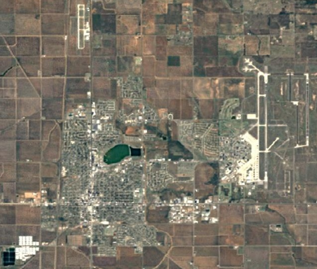</td>
    <td>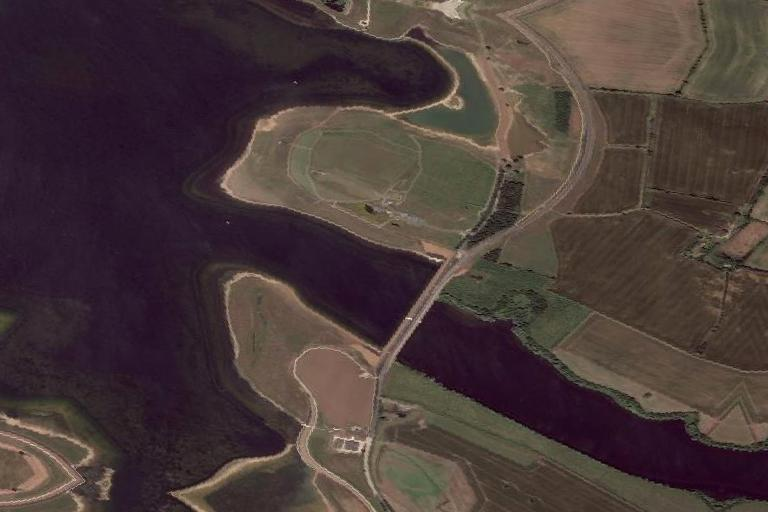</td>
    </tr>
    <tr>
    <td><b>Habour</b></td>
    <td><b>Island</b></td>
    </tr>
    <tr>
    <td></td>
    <td>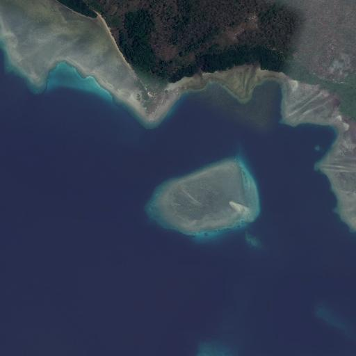</td>
    </tr>
    <tr>
    <td><b>Missile</b></td>
    <td><b>Oilplatform</b></td>
    </tr>
    <tr>
    <td>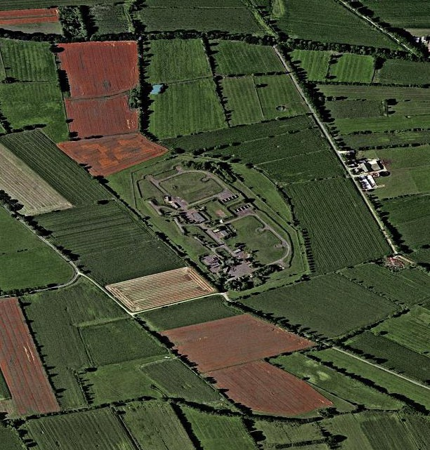</td>
    <td>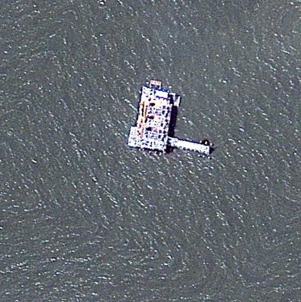</td>
    </tr>
    <tr>
    <td><b>Oiltank</b></td>
    <td><b>Plane</b></td>
    </tr>
    <tr>
    <td>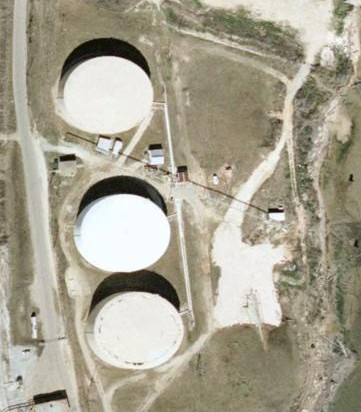</td>
    <td>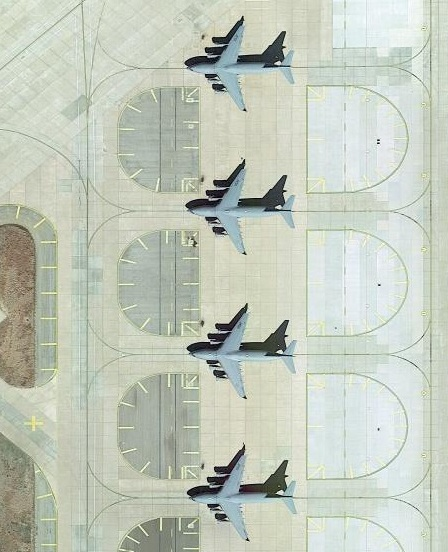</td>
    </tr>
    <tr>
    <td><b>Train</b></td>
    <td><b>Warship</b></td>
    </tr>
    <tr>
    <td>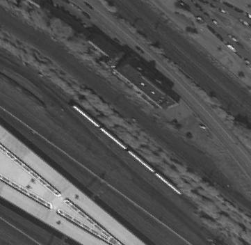</td>
    <td></td>
    </tr>
    </table>

---

## User Interface
### Main window
The interactive interface is divided into three parts. The upper left part is responsible for model training, the upper right part is responsible for target positioning of a small number of pictures, and the lower part is responsible for model performance evaluation based on a large amount of data.

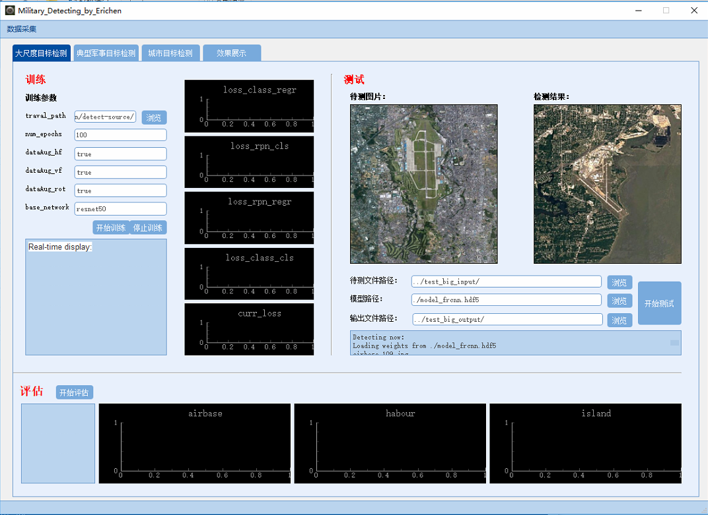

As a human-computer interaction interface, users only need to set the picture and label path to train the object detection model without considering the model structure and training skills

### Cut window
Because the remote sensing image is large, the image needs to be cropped before the model training. This interface is used to crop the remote sensing image of appropriate size

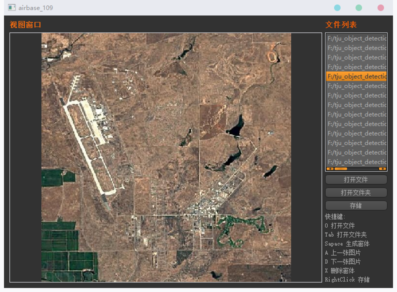

### Label window
Before training the model, you need to mark the target part of the image. This interface is used to mark the target

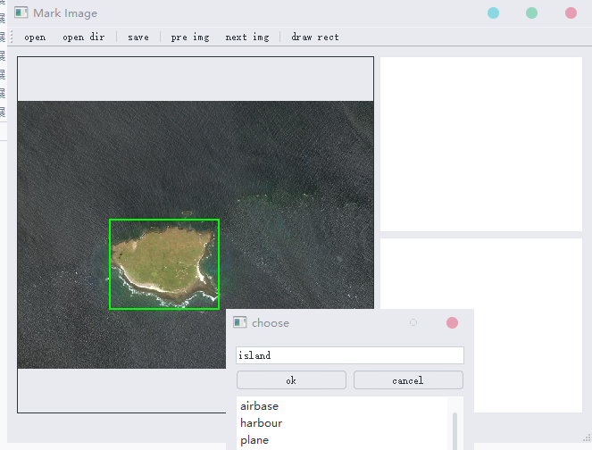

---

## Results

<table>
<tr>
<td>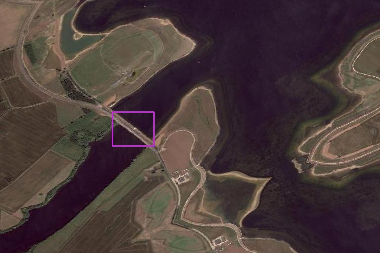</td>
<td>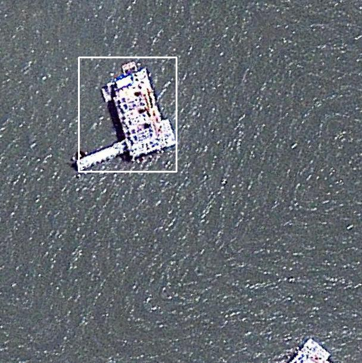</td>
<td>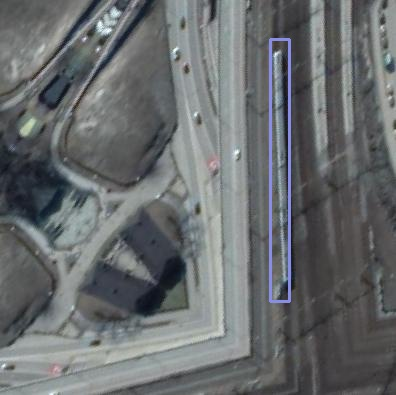</td>
</tr>
<tr>
<td>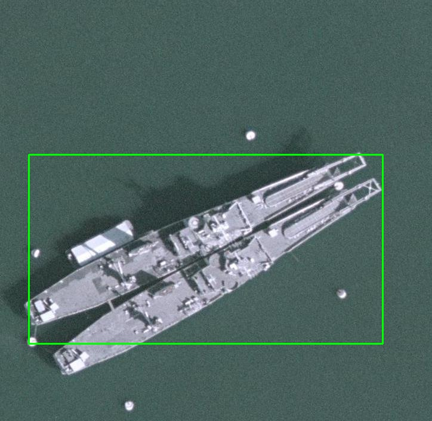</td>
<td>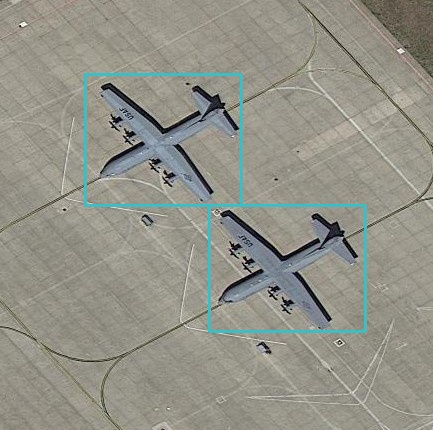</td>
<td>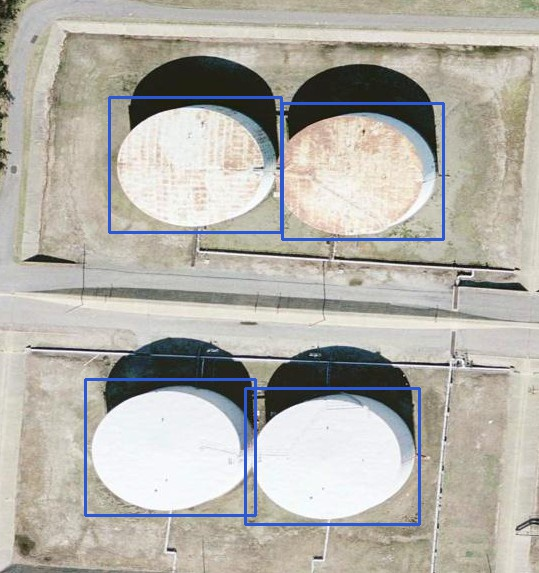</td>
</tr>
<tr>
</table>
